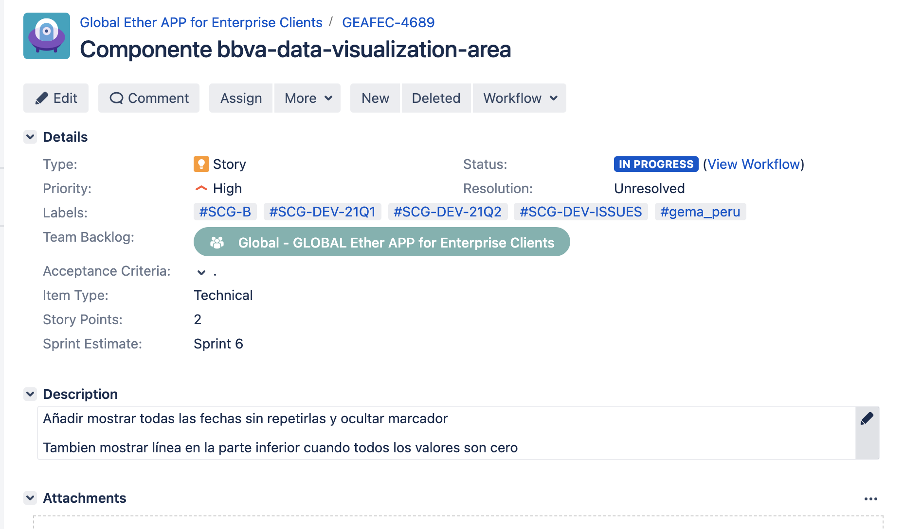

# Usar zshrc con colores

```zsh
    sh -c "$(curl -fsSL https://raw.github.com/ohmyzsh/ohmyzsh/master/tools/install.sh)"
```

# Instalar nvm

```zsh
    curl -o- https://raw.githubusercontent.com/nvm-sh/nvm/v0.38.0/install.sh | bash

    # Abrir archivo .zshrc y pegar
    export NVM_DIR="$([ -z "${XDG_CONFIG_HOME-}" ] && printf %s "${HOME}/.nvm" || printf %s "${XDG_CONFIG_HOME}/nvm")"
    [ -s "$NVM_DIR/nvm.sh" ] && \. "$NVM_DIR/nvm.sh" # This loads nvm

    # Ejecutar
    .source ~/.zshrc
```

## Comandos nvm

```zsh
    nvm list
    nvm use
    nvm install --lts
    nvm install 12.22.1
```

# Instalar cells
    
    [cells][https://platform.bbva.com/codelabs/cells/Cells%20Codelabs#/cells/Prepare%20your%20Cells%20Environment/Overview/]


# Artifactory

AKCp5dK4j8BYCE2ZxwLbH4kcCBrfquHgEGTp6KYsLt6yG88WHFhSkaCHadhgZt7BerFGxHD23

# Comandos gema-mock-server
REGION=PE npm run build && npm run dev


# PRs a catálogo
- Hacer fork del repo bbva-web-components
- Crear feature
- Crear tarjeta de Jira con las etiquetas correspondientes y poner a ready to verify

Ejemplo, tarjeta Jira para PR.


https://globaldevtools.bbva.com/jira/browse/GEAFEC-4689

Añadir las etiquetas y hacer commit con la etiqueta correspondiente.

- Hacer un solo commit, ej:
feat(bbva-list-movement): show amount when it is zero [GEAFEC-4326]
feat(bbva-data-visualization-area): add show all dates without repeating, bottom line when all values ​​are zero and hide marker [GEAFEC-4689]

- Lanzar PR de nuestra feature de nuestro repo a su repo.

# Rebase
git rebase -i HEAD~2
cambiar pick por squah en los que queremos unir, dejar el primero y comentar # los que no queremos y modificar mensaje

- git push origin --force

git commit --amend -m ""
# Vim
i    escribir
esc  para volver a linea de comandos
:wq  para salir guardando
:q!  salir sin guardar


# Commit sin pasar husky
git commit -m "" --no-verify


# Subir version de componente PR develop a master
- crear rama y modificar packgar, bower y changelog
version/tag-1.5.0

- generar changelog
gema convention:version

chore: updates bbva-gema-products-card-dashboard
build(release): 1.9.3

# Commits

- errores
fix:
- añadir cosas 
feat: 
- subir version
feat: 
        BREAKING CHANGE

# Rama 
- master

hotfix

# PRs
mireia.guinovart.contractor@bbva.com

# Borrar componentes App

rm -rf components node_modules package-lock.json
bower cache clean

npm i
bower i

npm run pe:test:start

# Añadir locales App

gema template:compat:literals-i18n-and-intl


# Ticket de glomo

Type: Dependency
Petitioner Team: vuestro equipo
Receptor Team : Global - GLOBAL GloMo Core
Labels: ServiceDesk soporte
Description: Comentarnos el problema o duda que tenéis, la rama en la que estáis trabajando y algún ejemplo concreto.

# Lanzar canal Cells

```zsh
$core[0].publish('card_product_retry_get_transactions', detail);
```

# Lanzar canal Cells nativo

```zsh
var params = { dateFormat:'yyyy-MM-dd'}

params.defaultDate = '2022-01-01'
"2022-01-01"
window.CellsNativePlugins.pluginManager.execute(console.log, console.log, 'DatePicker', 'get', params);
```

# Config Android

app.config.json 

```json

{
  "use": "peru",
  "environments": [
    {
      "id": "peru",
      "web": {
        "gema": "https://bbva-cells-files.s3.amazonaws.com/cells/apps/bbva_global_gema_app/gema-pe/master/cellsapp/PE/test.android/vulcanize/index.html",
        "glomo": "https://appassets.androidplatform.net/assets/www/index.html"
      }
    }
  ]
}


"gema": "https://appassets.androidplatform.net/assets/www2/index.html",

```


# Gema cli
- instalar
npm i -g gema-cli

https://globaldevtools.bbva.com/bitbucket/projects/BBVA_GLOBAL_GEMA_APP/repos/gema_cli/browse

# Merge Master to develop

Sacar rama de develop y mergear con Master, PR a develop


# BTGE comunicar con nativo

npm i -g @btge/ufe-cli@0.17.0-alpha.6


# Añadir indicadores
https://globaldevtools.bbva.com/bitbucket/projects/BBVA_GLOBAL_GEMA_APP/repos/gema-pe/pull-requests?create&targetBranch=refs%2Fheads%2Fdevelop&sourceBranch=refs%2Fheads%2Ffeature%2Fremove-indicators&targetRepoId=151293#app/composerMocksTpl/dashboard.js

bbva-gema-dashboard, añadir porpiedades:
  combineCards: ['STORES', 'STORE'],
  isArrayBbvaLink: true,

cells-gema-stores-dm, añadir propiedad:

  showIndicators: true