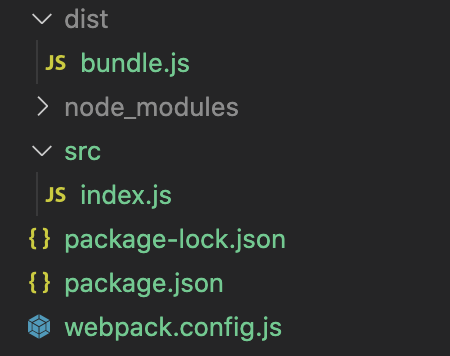

# Webpack
Webpack es un empaquetador de módulos.

## Documentación: 
- [Oficial](https://webpack.js.org/)  
- [Desarrolloweb](https://desarrolloweb.com/articulos/primeros-pasos-webpack.html)

## Instalar

```bash
    #Instalar globalmente
    npm install --global webpack webpack-cli
    #Instalar en el proyecto
    npm i -D webpack webpack-cli


    #Documentación con version 4 de webpack y 3 de webpack-cli
    npm install --global webpack@4 webpack-cli@3
```

## Crear proyecto
```bash
    # Crear carpeta
    mkdir <miProyecto>
    # Nos posicionamos dentro
    cd <miproytecto>
    # Crear package.json
    npm init

```

## packcage.json
Podemos ejecutar la build en el entorno de desarrollo o en el de producción.
```json
  "scripts": {
    "build": "webpack --mode production",
    "builddev": "webpack --mode development",
  },
```

## webpack.config.js 
Crear archivo webpack.config.js a la altura del packcage.json.
```js
    //Configuración básica de webpack

    //Módulo "path" de NodeJS
    const path = require('path');

    module.exports = {
        //Ubicación donde nos va a generar la build
        output: {
            path: path.resolve(__dirname, 'dist/'),
            filename: 'bundle.js'
        },
        //Punto de entrada para generar la build
        entry: {
            main: './src/index.js'
        }
    }
```

## Estructura proyecto


## Ejecutar build
```bash
    npm run build
```